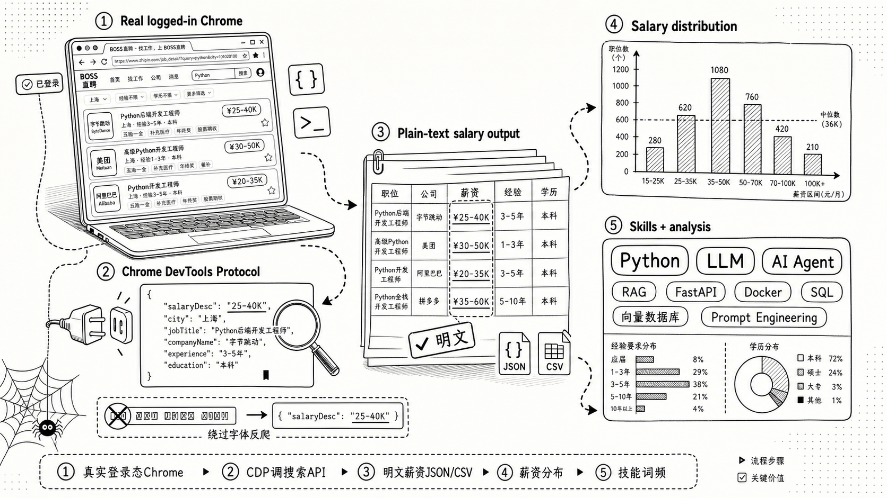

# BOSS直聘爬虫 · 职位抓取工具 v2.0（Chrome CDP / 明文薪资）

> 🌐 English documentation: [README.en.md](./README.en.md)


一个轻量的 **BOSS直聘爬虫（spider / crawler / scraper）**：通过 Chrome DevTools Protocol 连接本地已登录的 Chrome，复用真实登录态调用 zhipin.com 搜索 API，绕过前端字体反爬，输出含**明文薪资**的职位数据（JSON / CSV），并生成薪资分布、技能词频和求职材料优化提示词。同时作为 Hermes Agent Skill 提供。

> 📌 **一句话介绍**：不用 Selenium/Playwright，直接通过 Chrome DevTools Protocol 连接本地已登录的 Chrome，复用真实登录态调搜索 API，输出含明文薪资的 JSON/CSV，并生成薪资分布、技能词频和求职材料优化提示词。



---

## ⚠️ 免责声明

本项目仅供学习和技术研究参考，旨在探讨 Chrome DevTools Protocol、前端反爬机制与数据采集技术。请勿用于任何违反 [BOSS直聘用户协议](https://www.zhipin.com/about/protocol.html) 或相关法律法规的用途，不得用于商业转售、恶意爬取或对目标网站造成负担的行为。使用本项目所产生的一切后果由使用者自行承担，作者不对任何滥用行为负责。

---

## 🚀 30 秒快速开始

```bash
# 1. 克隆 + 装依赖
git clone https://github.com/eatmoreduck/boss-zhipin-scraper.git
cd boss-zhipin-scraper
pip install -r requirements.txt          # 或 uv sync

# 2. 启动隔离 Chrome 并登录（只需一次，登录态持久保存）
python3 scripts/boss_cdp_raw.py --setup-chrome

# 3. 抓取 + 分析
python3 scripts/boss_cdp_raw.py --keyword "AI Agent" --city 上海 --pages 3 --analysis

# 4. 抓取后生成聚合摘要 + 提示词（默认读取最新结果）
python3 scripts/job_summary.py

# 可选：实时终端浏览（不读离线 JSON，直接连 CDP 翻页/拉详情）
python3 scripts/boss_live_tui.py --keyword "AI Agent" --city 上海
```

抓完直接拿到：薪资分布、经验要求、高频技能词、求职材料优化提示词。提示词只基于岗位数据，不读取本地简历文件，也不给岗位算个人匹配分。

## ✨ 特性

- 明文薪资（API 模式，绕过字体反爬）
- JSON / CSV 双格式输出
- 详情页 JD 抓取 + 技能分析
- 实时终端 TUI（Textual）：列表、翻页、预览、按需拉详情
- 抓取后聚合摘要 + 可复制提示词
- 增量写入（异常退出不丢数据）
- 一键环境检查 + 持久隔离 Chrome CDP profile
- 多维筛选（规模、融资、薪资、经验、学历、行业）
- macOS + Linux 支持（Windows 代码分支已预留，未经实测，不保证可用）

<details>
<summary>🔍 为什么不选 Selenium / Playwright 类爬虫？</summary>

- Selenium/Playwright 会启动完整的受控浏览器，体积大、指纹明显，容易触发 BOSS 的风控和验证码。
- 本工具直接连接你已经登录的真实 Chrome（CDP），复用真实指纹和登录态，调用的也是页面内合法的搜索 API，返回的 `salaryDesc` 本就是明文——不需要解析被字体反爬加密的 DOM 薪资。
- 因此比传统 DOM 抓取类爬虫更稳定，也更难被识别为自动化流量。

</details>

## 安装

### 方式 1：克隆到本地再安装（推荐）

由于 `hermes skills install` 的网络请求在某些环境下可能无法直接访问 GitHub，推荐先克隆仓库再本地安装：

```bash
# 1. 克隆仓库
git clone https://github.com/eatmoreduck/boss-zhipin-scraper.git
cd boss-zhipin-scraper

# 2. 复制到 Hermes skills 目录
mkdir -p ~/.hermes/skills/data-science/boss-zhipin-scraper/scripts
cp SKILL.md ~/.hermes/skills/data-science/boss-zhipin-scraper/
cp scripts/boss_cdp_raw.py ~/.hermes/skills/data-science/boss-zhipin-scraper/scripts/
cp scripts/job_summary.py ~/.hermes/skills/data-science/boss-zhipin-scraper/scripts/
```

### 方式 2：curl 一键安装

不需要克隆整个仓库，直接下载必要文件：

```bash
mkdir -p ~/.hermes/skills/data-science/boss-zhipin-scraper/scripts && \
curl -sL https://raw.githubusercontent.com/eatmoreduck/boss-zhipin-scraper/master/SKILL.md \
  -o ~/.hermes/skills/data-science/boss-zhipin-scraper/SKILL.md && \
curl -sL https://raw.githubusercontent.com/eatmoreduck/boss-zhipin-scraper/master/scripts/boss_cdp_raw.py \
  -o ~/.hermes/skills/data-science/boss-zhipin-scraper/scripts/boss_cdp_raw.py && \
curl -sL https://raw.githubusercontent.com/eatmoreduck/boss-zhipin-scraper/master/scripts/job_summary.py \
  -o ~/.hermes/skills/data-science/boss-zhipin-scraper/scripts/job_summary.py
```

### 方式 3：hermes skills install（需网络直连 GitHub）

```bash
hermes skills install https://raw.githubusercontent.com/eatmoreduck/boss-zhipin-scraper/master/SKILL.md --category data-science
```

> 注意：此方式依赖 hermes 进程能直接访问 GitHub，如果遇到超时或连接失败，请使用方式 1 或 2。

### 验证安装

```bash
# 检查文件是否存在
ls ~/.hermes/skills/data-science/boss-zhipin-scraper/SKILL.md
ls ~/.hermes/skills/data-science/boss-zhipin-scraper/scripts/boss_cdp_raw.py
ls ~/.hermes/skills/data-science/boss-zhipin-scraper/scripts/job_summary.py
```

安装后直接在 Hermes 对话中说"帮我搜一下 BOSS直聘 上上海的 AI Agent 岗位"。

## 作为命令行工具使用

不想装成 Skill 也可以直接当 CLI 用：

```bash
# 1. 克隆 + 安装依赖
git clone https://github.com/eatmoreduck/boss-zhipin-scraper.git
cd boss-zhipin-scraper
pip install -r requirements.txt

# 2. 启动 Chrome CDP
python3 scripts/boss_cdp_raw.py --setup-chrome
# 首次使用也不会复制主 Chrome 登录态；请在弹出的 BOSS 专用浏览器中登录 zhipin.com
# setup 会等待登录完成，并确认接口能返回明文薪资

# 3. 检查环境
python3 scripts/boss_cdp_raw.py --check

# 可选：真实浏览器/API smoke test（不写结果文件）
python3 scripts/boss_cdp_raw.py --smoke-test

# 4. 抓取
python3 scripts/boss_cdp_raw.py --keyword "AI Agent" --city 上海 --pages 3 --format csv --analysis

# 5. 实时终端浏览（只走 Chrome CDP，不读本地 JSON）
python3 scripts/boss_live_tui.py --keyword "AI Agent" --city 上海

# 6. 抓取后摘要和提示词
python3 scripts/job_summary.py --top 15
```

## 参数

| 参数 | 说明 |
|------|------|
| `--keyword` | 搜索关键词（默认 "AI Agent"） |
| `--city` | 城市（中文或代码，默认上海） |
| `--pages` | 页数（上限 10） |
| `--format` | json / csv；csv 会导出列表 CSV；开启 `--detail` 时也会导出详情 CSV |
| `--detail` | 抓取详情页 JD（默认关闭，详情页较慢，需显式开启） |
| `--no-detail` | 不抓取详情页 |
| `--analysis` | 分析报告 |
| `--merge FILE` | 合并已有数据（按 job_id 去重） |
| `--allow-dom-fallback` | API 无数据时允许降级 DOM 提取；默认关闭，薪资可能不可信 |
| `--check` | 环境检查（CDP + 依赖 + 登录态） |
| `--smoke-test` | 用真实 Chrome/CDP 跑一次 BOSS 搜索 API smoke test，不写结果文件 |
| `--setup-chrome` | 一键启动 Chrome CDP（持久隔离 profile） |
| `--copy-login-state` | 手动导入主 Chrome 的 Local State + Cookie 相关文件到隔离 profile（默认、首次启动、重复启动都不复制） |
| `--reset-chrome-profile` | 重建 BOSS 专用 Chrome profile，会清除此专用浏览器内的登录态 |
| `--no-wait-login` | `--setup-chrome` 启动后不等待登录完成 |
| `--login-timeout` | `--setup-chrome` 等待登录完成的秒数（默认 300） |
| `--output` | 列表输出路径（默认 `~/.boss-zhipin-scraper/job-result/`） |
| `--detail-output` | 详情输出路径（默认 `~/.boss-zhipin-scraper/job-result/`） |
| `--cdp-port` | CDP 端口（默认 9222） |
| `--scale/--salary/--experience/--degree` | 筛选条件 |

## 实时终端 TUI

`scripts/boss_live_tui.py` 是一个 Textual 终端界面，只走实时 Chrome CDP，不读取离线 JSON：

```bash
python3 scripts/boss_live_tui.py --keyword "AI Agent" --city 上海
# 或安装后
uv run boss-live --keyword "AI Agent" --city 上海
```

交互：

- `n` / `→` / `PageDown`：实时拉下一页
- `p` / `←` / `PageUp`：实时拉上一页
- `Enter` / 鼠标选中行：实时打开详情页并提取 JD
- `d` / `u`：详情面板向下 / 向上滚动
- `m`：打开 TUI 内消息中心，查看会话/未读
- `Esc` / `j`：从消息中心返回职位列表
- 消息中心内 `Enter`：打开会话；底部输入框输入回复并按 `Enter` 发送
- 职位列表内 `g`：准备打招呼；再次按 `g` 二次确认后点击 BOSS 的“立即沟通”
- `r`：刷新当前页
- `q`：退出

如果 CDP 未启动或 BOSS 未登录，它会直接提示先运行 `python3 scripts/boss_cdp_raw.py --setup-chrome`。

消息/打招呼相关能力都走真实 BOSS 页面：

- TUI 开着时每 60 秒轮询一次消息列表，有未读会在顶部状态栏提示；如果某次轮询为空，会保留上一份会话列表
- 回复必须由你在输入框输入并按 Enter 发送
- 打招呼需要连续按两次 `g` 确认，避免误触
- 不做批量群发，不自动生成并发送内容

如需排查 BOSS 页面结构，可运行只读探测：

```bash
uv run boss-message-probe --url https://www.zhipin.com/web/geek/chat --click-first
```

### AI / MCP 预留

实时 TUI 当前不内置 AI Chat，但代码里已经把实时取数层和 UI 层分开：

- `LiveBossClient.fetch_page()`：实时获取列表页
- `LiveBossClient.fetch_detail()`：实时获取选中岗位详情
- `LiveBossClient.fetch_conversations()` / `fetch_current_chat()`：实时获取会话和聊天记录
- `LiveBossClient.build_agent_context()`：输出 JSON 可序列化的岗位上下文，供后续 MCP tool、内置 AI Chat、Codex/Claude Code 集成复用

下一阶段建议优先做 MCP/agent 接口，而不是直接把大模型逻辑写死在 TUI 里。这样 TUI 可以继续负责浏览和选择岗位，AI 负责基于当前选中岗位做简历改写、面试准备、岗位风险判断等动作。

## 抓取后摘要与提示词

`scripts/job_summary.py` 只读取已抓取的 `boss_jobs_*.json` 和 `boss_details_*.json`，做简单聚合分析并生成一段可复制提示词。它不读取本地简历文件，不引入 PDF 依赖，也不给个人与岗位做分数判断。

```bash
# 读取默认结果目录下最新的 boss_jobs_*.json，并自动匹配同时间戳或最新详情文件
python3 scripts/job_summary.py

# 指定列表和详情文件
python3 scripts/job_summary.py \
  --input ~/.boss-zhipin-scraper/job-result/boss_jobs_20260625_1200.json \
  --details ~/.boss-zhipin-scraper/job-result/boss_details_20260625_1200.json \
  --top 15

# 只输出提示词
python3 scripts/job_summary.py --prompt-only
```

打包安装后也可以使用入口命令：

```bash
uv run boss-summary --top 15
```

摘要会覆盖这些维度：薪资区间、经验要求、学历要求、地区分布、高频公司、技能标签、JD 高频词。提示词会要求模型基于这些统计去做简历关键词补齐、项目经历改写方向和面试准备清单，但明确要求不要虚构经历。

## 文件结构

```
boss-zhipin-scraper/
├── SKILL.md              # Hermes Skill 定义
├── README.md
├── CHANGELOG.md
├── LICENSE
├── pyproject.toml
├── scripts/
│   ├── boss_cdp_raw.py   # 抓取主脚本
│   └── job_summary.py    # 抓取后摘要 + 提示词
└── requirements.txt
```

## 工作原理

这是一个基于 Chrome CDP 的 BOSS直聘爬虫，核心流程：

1. 通过 Chrome DevTools Protocol (CDP) 连接到已打开的 Chrome
2. 在 BOSS直聘页面内注入 JS，用同步 XHR 调用搜索 API
3. API 返回明文 `salaryDesc`，绕过前端字体反爬
4. 列表 API 保留 `securityId` / `lid` 等上下文，进入详情页时带上这些参数
5. 每页抓完立即写入文件，按 `job_id` 去重

默认不会使用 DOM 提取列表，因为 DOM 薪资可能受字体反爬影响。只有明确传 `--allow-dom-fallback` 时，API 无数据才会降级 DOM。

`--input ... --analysis --no-detail` 会优先加载 `--detail-output`，其次加载与输入列表同目录、同时间戳的 `boss_details_*.json`，最后查找 `~/.boss-zhipin-scraper/job-result` 下最新详情文件。

## Chrome profile 安全策略

`--setup-chrome` 默认使用持久隔离 profile，不软链接、不复制你的主 Chrome 数据。首次启动和后续重复启动都只是创建或复用这个专用 profile：

- `~/.boss-zhipin-scraper/chrome-profile`

未显式指定 `--output` 或 `--detail-output` 时，抓取结果默认保存到：

- `~/.boss-zhipin-scraper/job-result`

首次使用需要在这个专用 Chrome 中手动登录 BOSS直聘。`--setup-chrome` 会等待登录完成，并用搜索接口确认能拿到明文 `salaryDesc` 后再返回。登录态保存在专用 profile 内，重启机器后仍然保留；重复运行 `--setup-chrome` 不会清空它，也不会影响主 Chrome、Gmail、GitHub 等账号。

如确实需要从主 Chrome 手动导入 BOSS 登录态，可以显式运行：

```bash
python3 scripts/boss_cdp_raw.py --setup-chrome --copy-login-state
```

`--copy-login-state` 每次运行都会覆盖隔离 profile 内对应的 Cookie 相关文件；日常启动不要加这个参数。它只复制 `Local State` 和 `Default/Cookies*`、`Default/Network/Cookies*` 这类 Cookie 数据库相关文件，不复制密码库、历史记录、扩展或完整 profile。需要清空专用浏览器登录态时使用：

```bash
python3 scripts/boss_cdp_raw.py --setup-chrome --reset-chrome-profile
```

## License

MIT

## 友情链接

- [LINUX DO](https://linux.do/) — 真诚、友善、充满活力的技术社区，本项目认可并推荐。

## Star History

[](https://star-history.com/#eatmoreduck/boss-zhipin-scraper&Date)
