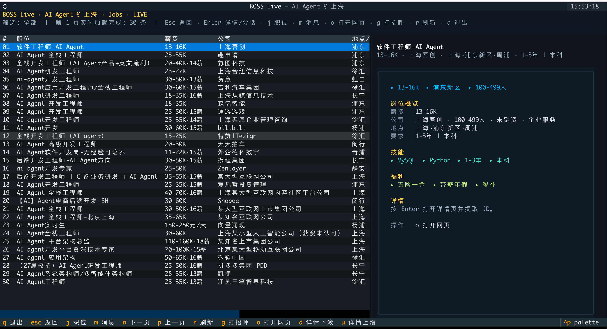
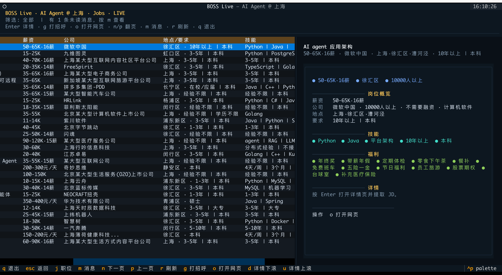
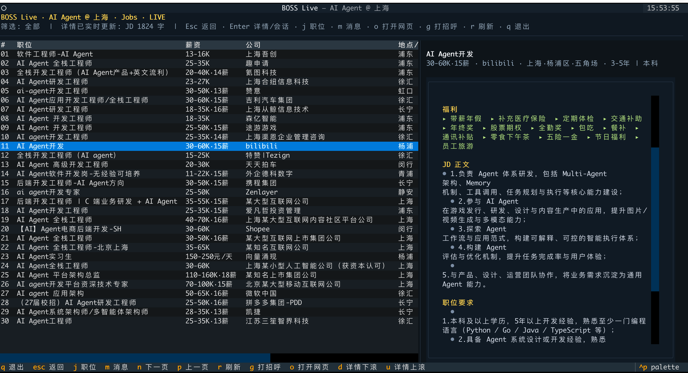
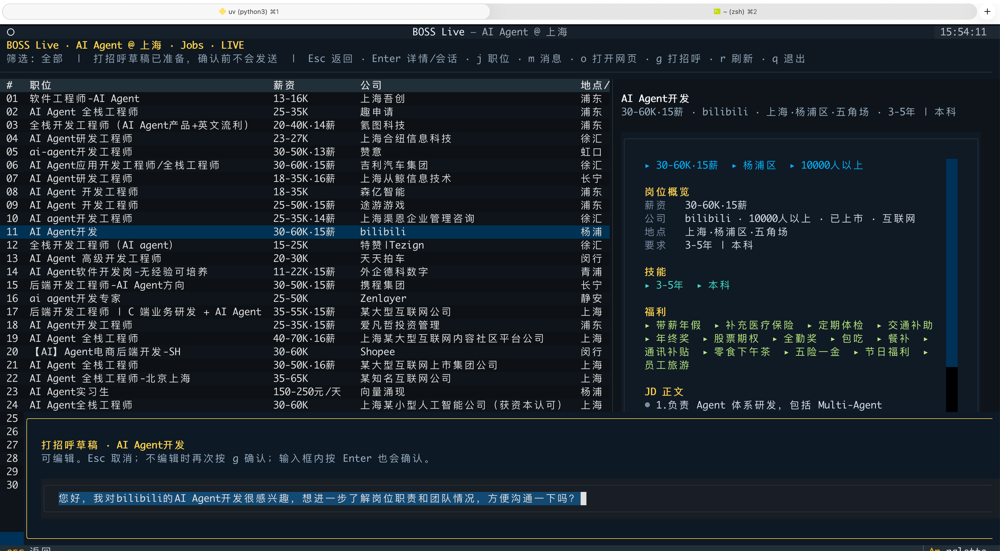
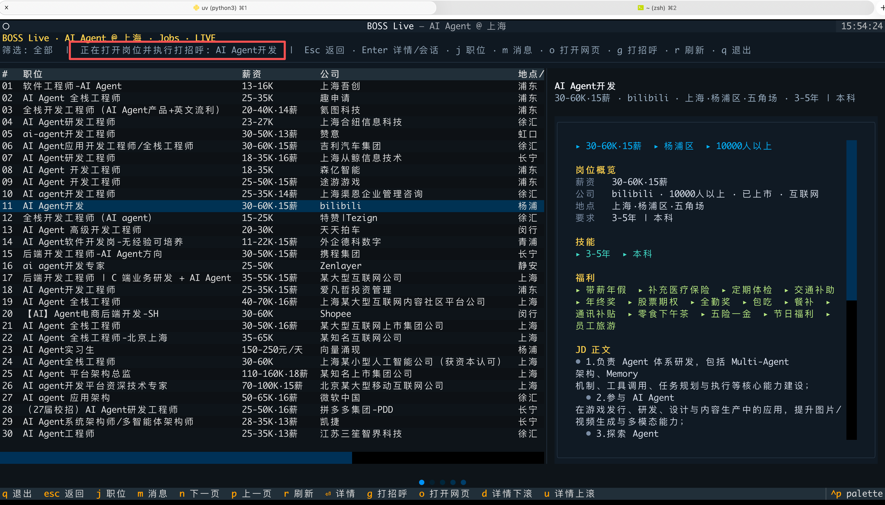
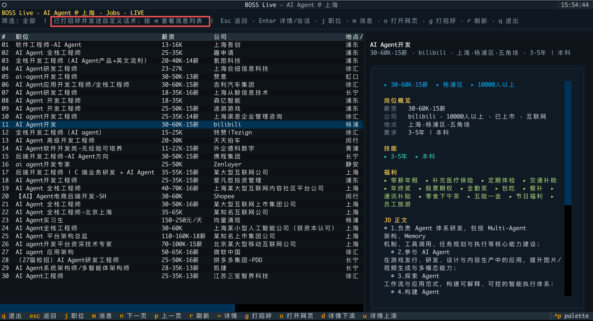
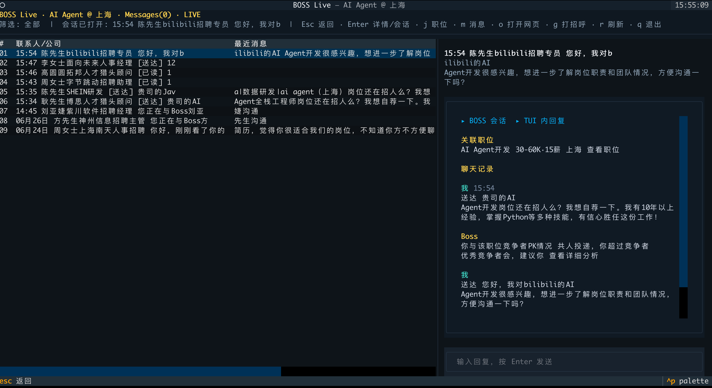

# BOSS Live TUI · BOSS直聘实时终端工作台 v2.0

> 爬虫版本 / CLI / Hermes Skill 详细文档已移到 [README.crawler.md](./README.crawler.md)。
> English documentation: [README.en.md](./README.en.md)


一个基于 Chrome CDP 的 BOSS 直聘实时终端界面。它把 BOSS 网页里的岗位列表、岗位详情、消息会话和回复操作投影到 Terminal 里，用键盘完成搜索、翻页、预览、打招呼和聊天。

核心目标很简单：少切窗口、少重复请求、少干扰，用一个 TUI 快速浏览岗位和处理沟通。

## 能做什么

- 实时职位列表：按关键词、城市和筛选条件读取 BOSS 搜索结果。
- 翻页浏览：`n` / `p` 或方向键翻页，列表直接在终端刷新。
- 详情预览：选中岗位后按 `Enter` 拉取 JD，详情内容完整展示。
- 风控控制：默认不自动拉详情，避免频繁请求；详情只在你确认后读取。
- 本地详情缓存：详情页在本次运行中命中过就直接展示，减少重复请求。
- 消息中心：在 TUI 内查看 BOSS 会话列表、未读状态和聊天历史。
- TUI 内回复：底部输入框输入消息，按 `Enter` 发送到当前会话。
- 打招呼确认：按 `g` 弹出话术草稿，可编辑；再次确认后执行。
- 后台 Chrome CDP：尽量使用后台 target，不主动把 Chrome 页面唤到最前。
- AI / MCP 预留：已保留结构化上下文接口，后续可以接 MCP tool、Agent 或内置 AI Chat。

当前运行策略：

- 职位列表：实时读取，不走 SQLite。
- 消息列表 / 聊天历史：实时读取，不走本地存储。
- 岗位详情：只使用运行期内存缓存，退出后失效。
- SQLite 缓存类还保留在代码里，但当前 TUI 没有启用。

## 快速开始

```bash
# 1. 安装依赖
uv sync

# 2. 启动隔离 Chrome，并在这个专用浏览器里登录 zhipin.com
uv run python3 scripts/boss_cdp_raw.py --setup-chrome

# 3. 检查 CDP 和登录态
uv run python3 scripts/boss_cdp_raw.py --check

# 4. 启动实时 TUI
uv run python3 scripts/boss_live_tui.py --keyword "AI Agent" --city 上海
```

仍然可以使用原始抓取脚本：

```bash
uv run python3 scripts/boss_cdp_raw.py --keyword "AI Agent" --city 上海 --pages 3 --analysis
uv run python3 scripts/job_summary.py
```

`job_summary.py` 会基于已抓取岗位生成市场摘要和提示词；更多 CLI 参数见 [README.crawler.md](./README.crawler.md)。

## 常用快捷键

| 快捷键 | 作用 |
|---|---|
| `j` | 回到职位列表 |
| `m` | 打开消息中心 |
| `n` / `→` / `PageDown` | 下一页 |
| `p` / `←` / `PageUp` | 上一页 |
| `Enter` | 职位模式下读取详情；消息模式下打开当前会话 |
| `g` | 打招呼草稿 / 再次确认发送 |
| `o` | 在浏览器打开当前岗位网页 |
| `Tab` | 在左侧列表和右侧详情面板之间切换焦点 |
| `d` / `u` | 右侧详情向下 / 向上滚动 |
| `r` | 刷新当前视图 |
| `Esc` | 返回上一级 / 取消弹窗 |
| `q` | 退出 |

## 截图

### 1. 职位列表



### 1.1 职位详情



### 2. JD 详情预览



### 3. 打招呼草稿



### 4. 打招呼提示



### 5. 打招呼提示



### 6. TUI 内回复



### 动态演示


## 架构边界

TUI 主要由两层组成：

- `LiveBossClient`：负责 Chrome CDP、实时职位列表、详情、消息列表、当前聊天和发送动作。
- `BossLiveApp`：负责 Textual UI、键盘交互、状态切换、详情展示和消息面板。

为后续 AI / MCP 集成预留的入口：

- `LiveBossClient.fetch_page()`：获取实时职位列表。
- `LiveBossClient.fetch_detail()`：获取当前岗位详情。
- `LiveBossClient.fetch_conversations()`：获取会话列表。
- `LiveBossClient.fetch_current_chat()`：获取当前聊天历史。
- `LiveBossClient.build_agent_context()`：输出 JSON 可序列化岗位上下文。

建议下一阶段把这些能力包装成 MCP tools/resources，让 Codex、Claude Code 或自定义 Agent 读取当前岗位上下文，再做简历改写、沟通话术、面试准备和岗位分析。TUI 保持负责浏览、选择和人工确认。

## 安全和使用边界

- 项目仅供学习和个人研究，请遵守 BOSS 直聘用户协议和相关法律法规。
- 建议使用 `--setup-chrome` 创建的隔离 Chrome profile，不影响你的主 Chrome。


## 未来可能迭代计划
- 批量群发，LLM自动循环打招呼。
- 发送消息，实时转发聊天记录到微信chatbot


## 相关文档

- [爬虫版 / CLI 文档](./README.crawler.md)
- [英文文档](./README.en.md)

## Friendly Link

- [LINUX DO](https://linux.do/) — a Chinese developer community.

## License

MIT
